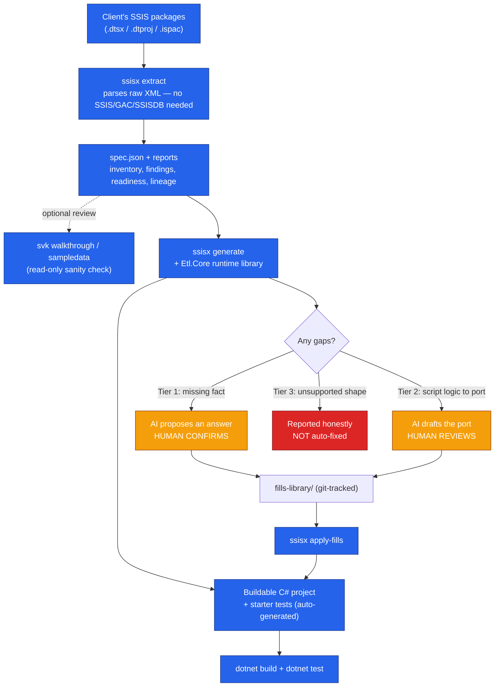
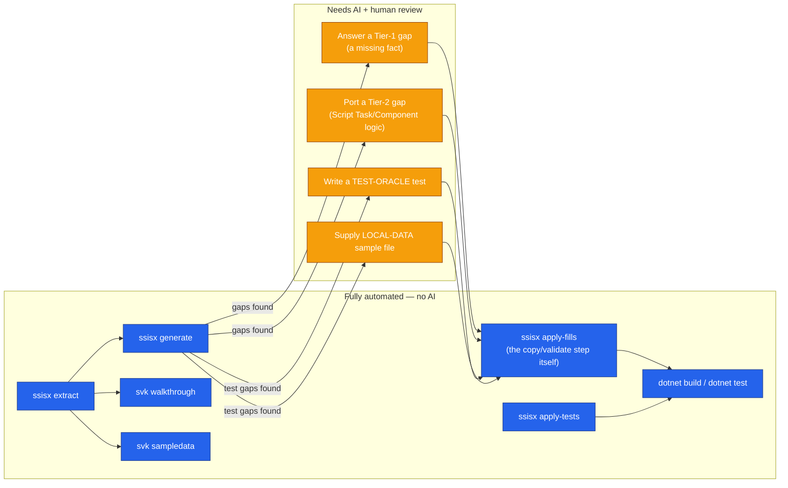

# SSIS → C# Migration Toolkit — Handover Overview

**Purpose of this document:** a walkthrough script for handing this tooling over to another
team. It covers what we built, how it works, and where the lines are between "the tool does
this automatically" and "a human/AI needs to make a call here." Written to be read top to
bottom during a call, with diagrams to point at.

---

## 1. What we built, at a glance

Three things, each with a distinct job:

| Tool | What it is | Why it's separate |
|---|---|---|
| **`ssisx`** | The extractor + C# generator CLI | This is the core product. Reads `.dtsx` files, understands them, and writes runnable C# from them. |
| **`Etl.Core`** | A hand-written C# runtime library | The generated code isn't self-contained — it calls into this shared library for things like bulk SQL writes, CSV reads, and the package-run host. Written once by us, not generated per package. Every generated project references a copy of it. |
| **`svk`** | A separate, read-only review tool | Produces a human-readable "walkthrough" doc and sample data for a package, purely for sanity-checking. It never edits anything and never writes C# — it's optional, and safe to skip. |

**Tech stack:**
- **C# / .NET** throughout. The CLI tool itself runs on **.NET 8**; the *generated* output can
  target either **.NET 8** or **.NET 10** (your choice, via a flag — more below).
- **Entity Framework Core** for the generated database access (version depends on which .NET
  target you pick — 10.0.11 for .NET 10, 9.0.15 for .NET 8, since EF Core's SQL Server provider
  only supports one major version per framework).
- **Microsoft's own real T-SQL parser** (`Microsoft.SqlServer.TransactSql.ScriptDom`) for reading
  the SQL text embedded in packages — not a home-grown SQL parser.
- **A hand-built SSIS expression-language parser/evaluator** — because SSIS's expression
  language (`SUBSTRING`, `DATEADD`, ternary operators, NULL logic, etc.) has no public spec. We
  didn't guess at its rules; we measured them (see the callout box below).
- **`ExcelDataReader`** for reading `.xlsx` files — a pure .NET library, not Microsoft's Excel
  driver, so the generated code has no Windows-only dependency.
- **xUnit + coverlet** for the tests the tool generates and their coverage reports.

### How extraction actually works

This is the single most important design decision in the whole project:

> **We parse the raw `.dtsx`/`.dtproj`/`.ispac` XML files directly — as text/XML, not through
> the SSIS object model, not through the GAC, not through a live SSIS install, and not through a
> deployed SSISDB catalog.**

That means:
- It runs on **any machine with .NET installed** — the client's own laptop, a CI agent, whatever.
- No SQL Server, no SSIS runtime, no SSISDB, no VPN into a client's server needed.
- It works on packages built by **any version of SSIS**, because it never depends on a specific
  SSIS DLL being installed.
- Output is **deterministic** — running it twice on the same input gives byte-identical results
  (aside from a timestamp field) — which matters for CI and for trusting the tool at all.

The extraction step produces one canonical "spec" — a big, structured JSON description of a
package's control flow, data flow, expressions, SQL text, and connections. Every other command
(reporting, gap analysis, code generation, testing) reads from that one spec. Nothing re-parses
the `.dtsx` XML twice.

> **"Measure, don't guess" — a running theme.** SSIS's actual runtime behavior for tricky cases
> (how it rounds a float when narrowing to an int, what a Lookup does with duplicate keys, what
> order a Merge Join uses, whether a disabled task's downstream still runs) is often undocumented
> or under-documented. Rather than guess, we built small SSIS packages, ran them for real through
> the actual SSIS engine (`dtexec`), and measured the true behavior — then reproduced that exact
> behavior in the generated C#. This is why the tool is described internally as "gaps, not
> guesses": if we haven't measured a behavior, the tool reports an honest gap instead of
> inventing one.

---

## 2. The commands

Deliberately small: **four commands** for `ssisx`, **two** for `svk`. (`ssisx` used to have six —
`extract`/`graph`/`report`/`conformance`/`testgen`/`diff` — we merged five of those into one
`extract` call because they all independently re-read the same input anyway; keeping them
separate just meant more names to remember.)

| Command | What you give it | What it gives back |
|---|---|---|
| `ssisx extract` | A folder of `.dtsx` files (or one file) | The full spec, an inventory of every package, a complexity/readiness report, lineage diagrams, "what this package requires of a replacement" obligations, and generated expression tests |
| `ssisx generate` | Same input, plus a copy of `Etl.Core`, plus a folder for AI-authored answers | A buildable C# project per package, a starter test project, and — if anything couldn't be translated — a folder of "gap" work packets explaining exactly what's missing |
| `ssisx apply-fills` | Human/AI-authored answers to those gaps | Copies validated answers into the generated code; reports what's still outstanding |
| `ssisx apply-tests` | Optional hand-picked *extra* tests for an already-working package | Copies them in — this is enrichment, not gap-filling (see section 4) |
| `svk walkthrough` | The output of `extract` | A plain-English, execution-order description of a package — good for a human sanity check before generating |
| `svk sampledata` | The output of `extract` | Realistic, schema-correct sample CSV/SQL/DDL data for a package, deterministic (same seed → same output every time) |

**Typical flow for one package:**

```powershell
ssisx extract  --input C:\client-packages --out out --recursive
ssisx generate --input C:\client-packages --out out --recursive `
               --package LoadEmployees --etl-core Etl.Core --fills fills-library
dotnet build out\generate\Generated.slnx
```

`extract` is cheap and read-only — safe to run across an entire portfolio at once, and usually
the first thing to do so we know what we're dealing with. `generate` is normally scoped to one
package or a small named batch at a time (`--package Name1,Name2`) rather than "generate
everything," simply because a real portfolio can be dozens of packages and reviewing them one
at a time is more manageable — though "generate everything" is one flag away if that's what's
wanted.

**Exit codes worth knowing:** `0` = clean, zero gaps. `3` = code was written but there's
follow-up work (this is the *normal*, expected result on a real package — not a failure). `2` =
you typed something wrong. `1` = a real problem (e.g. a check failed).

---

## 3. How we find gaps, and how `apply-fills` closes them

Not every `.dtsx` file gives us everything we need to write correct C#. Sometimes information is
genuinely missing from the file; sometimes there's a hand-written script inside the package that
has to be read and ported by a person; sometimes the package uses a shape we simply haven't
built support for yet. We split these into **three tiers**, and each tier is handled completely
differently — this is the most important thing to explain clearly on the call, because it's what
keeps the tool trustworthy:

| Tier | What it means | Example | Who resolves it | What lands in the code |
|---|---|---|---|---|
| **Tier 1 — Missing Datum** | A single fact isn't recorded in the `.dtsx` at all | A Lookup's join key was never saved by SSIS | AI proposes an answer with its reasoning; **a human confirms it** | **Nothing AI-written** — it's just a fact, recorded in a small JSON file. The tool's own deterministic code generator still writes every line of C#. |
| **Tier 2 — Missing Logic** | The real logic *is* in the package (e.g. a Script Task/Component), but it can't be mechanically translated | A C# or VB.NET script inside a Script Task | AI drafts a translation, ported into the generated code's own style; **a human reviews it** | Real, provenance-stamped C# in a separate "fills" file |
| **Tier 3 — Missing Tool Support** | The tool has no model at all for this shape of package | An unsupported component combination | **Nobody, via AI — deliberately** | Nothing. This becomes a note for us (the tool builders) to add real support later, not a one-off patch |

**Why Tier 3 is refused rather than "fixed" by AI:** if we let AI patch around a shape the tool
doesn't understand, we'd hide a systemic gap in our own tool behind a pile of one-off
per-package workarounds — the opposite of what a report to a client is supposed to surface. A
Tier 3 gap is reported honestly as "we don't support this yet," which is far more useful than a
guess that might be silently wrong.

### The mechanics

- Every gap gets a **self-contained "work packet"** — a markdown file with everything needed to
  answer it: the exact question, the relevant evidence from the package, and the exact format
  the answer needs to be in. No need to go digging through the original `.dtsx`.
- Answers are written into a folder called **`fills-library`** — deliberately kept *outside* the
  disposable generated-output folder, and checked into source control, so a "clean regenerate"
  can never accidentally throw away real, already-reviewed work.
- `ssisx apply-fills` copies validated answers into the generated project and reports each one
  as **Applied / Stale / Orphaned**:
  - *Applied* — matches the gap it was written for, copied in.
  - *Stale* — the underlying package changed since the fill was written (checked via a hash of
    the original evidence) — **refused**, not silently applied, so a fill can never quietly
    answer a question that's since changed.
  - *Orphaned* — answers a gap that doesn't exist (any more) — refused, and flagged.
- **Compile-time enforcement, not a comment saying "TODO":** an unfilled Tier‑2 gap is generated
  as an empty `partial` method. The project **will not compile** until it's filled — a single
  clear compiler error (`CS8795`) per unanswered gap, not a silently-dropped column or a script
  that runs and quietly does nothing.

---

## 4. Unit tests: what the tool writes automatically vs. what needs AI

There are actually **two, separate test-related workflows** — worth being precise about this,
since it's the single most common point of confusion:

### A. Starter tests — 100% mechanical, generated automatically, no AI

Every `ssisx generate` run also writes a whole xUnit test project alongside the main code —
**no extra step, no AI, no flag needed** (unless you pass `--skip-tests`). It writes one test per
generated method: every SQL statement, every source/sink, every transform, every router, every
loop. Expected values aren't guessed — they're computed through the same measured, oracle-verified
expression engine mentioned above.

Running `dotnet test --filter Category!=Integration` right after a fresh `generate`, with **zero**
fills applied, is expected to pass on any machine — it needs no real database, no real files, no
client connection at all. That's the "always-green baseline."

### B. Where AI *does* come in for testing — two specific gap kinds

A small number of things genuinely can't be tested without either real data or a judgment call —
these are reported as gaps too (via the same Tier-1/2 system above, not a separate mechanism):

| Gap kind | What it needs | Where the answer goes |
|---|---|---|
| **`TEST-ORACLE`** | A test the tool can't derive on its own — e.g. testing a Script Component once its logic has been ported by a human, or a Conditional Split branch too complex to auto-verify | A new xUnit test file, written by AI/human, reviewed |
| **`LOCAL-DATA`** | A realistic sample file for a real source (CSV, Excel, fixed-width) so its "real read" test can actually run | A realistic sample file matching the exact schema the packet specifies |

Both are answered and applied through the **same command** as everything else:
```powershell
ssisx apply-fills --out out --fills fills-library
```

### C. A *third*, separate, optional command — not gap-related at all

Once a package is already fully green (builds, all tests pass, zero fills outstanding), a
different command lets someone **voluntarily add more test coverage** — this is enrichment, not
gap-filling, and never affects whether a package "counts" as done:

```powershell
ssisx apply-tests --out out --fills fills-library
```

It reads hand-written test files from a different folder (`fills-library\<Package>\MoreTests\`)
and copies them in unconditionally — no staleness tracking, because there's no specific gap being
answered.

**Rule of thumb for the call:** *"Generate always gives you real tests for free. AI only gets
involved for the handful of tests that genuinely need either ported script logic or realistic
sample data — and even then, everything stops for a human to review before it's applied."*

---

## 5. How sample and test data is actually generated

There are **two separate places** this happens, doing two different jobs — worth keeping them
apart, since it's easy to conflate them:

1. **`svk sampledata`** — a standalone, optional sanity-check tool, run manually, before you even
   look at generated code.
2. **The sample/test data baked into `ssisx generate`'s own output** — what actually makes the
   generated test project's tests pass or fail.

### A. `svk sampledata` — deterministic synthetic data for a quick human sanity check

Reads the same spec `ssisx extract` already wrote, and writes out realistic-**looking**,
schema-correct sample data per package. Entirely deterministic — same `--seed` → byte-identical
output every time, so it's safe to re-run and diff.

| Output | What it is |
|---|---|
| `<Component>.csv` | One per delimited Flat File source — header + N rows, type/length-correct against the source's own declared schema |
| `<Component>.txt` | One per fixed-width/RaggedRight source — a positional layout, each value padded/truncated to its real declared column width (matches SSIS's *measured* real write behavior, not a guess) |
| `<Component>.xlsx` | One per Excel source — a real, openable workbook, columns written in the exact order the generated reader expects (Excel is read purely by position, never by column name) |
| `<Component>.sql` | One per SQL source — `CREATE TABLE` + `INSERT` |
| `<Component>.expected.sql` | One per destination — `CREATE TABLE` only; a place to load the generated code's own output for comparison |
| `<Lookup>.reference.sql` | One per Lookup with a resolvable join key — its reference table, seeded from a key pool **shared** with the main flow's own data, so ~70% of rows genuinely match (exercises the match path) and ~30% deliberately don't (exercises the no-match path) |
| `schema.sql` | Every destination table the package touches, in one file (primary-key lines marked `INFERRED`, since a `.dtsx` carries no real primary-key concept) |

**How the values themselves are produced, and why it's safe to trust as "the same every time":**
each value comes from a random-number generator seeded off a hash of `(package name, component
name, column name, your --seed, row number)` — so the same input and seed always produce
byte-identical output, while two different columns (or two different rows) never accidentally
collide on the same value. About 10% of eligible values get a `NULL` injected (Excel is the one
exception — the generated Excel reader has no null-handling yet, so an Excel sample never gets
one). **Values are schema-correct, not business-realistic** — right type, right length, right
precision/scale — with no attempt to bias toward an interesting edge case (e.g. a value that
would flip a Conditional Split's condition one way or the other).

This step never blocks anything and is entirely optional — a quick "does this look sane" check
before or alongside generation, not something the pipeline depends on.

### B. The generated test project's own sample data — a **two-tier** system

This is the one that actually decides whether a generated test passes or fails. Every `ssisx
generate` run writes a starter test project (section 4), and every file-based source in it needs
some data to read during a test. There are two tiers, answering two different questions:

**Tier A — synthesized automatically, ships with every `generate` run, zero AI, zero fills.**
`ssisx` writes a small (2–3 row) sample straight from the source's own declared column names,
widths, and types into `{Package}.Tests\SampleData\`. **Nothing at runtime — production or
test — actually reads this file any more.** It exists purely as a schema-correct *starting
point* for a human/AI to write the real Tier B data from (the same role `svk sampledata` plays
above, just scoped to a single source). Earlier, a test silently passed against this fabricated
data, which meant "tests pass" didn't actually prove much for a file-based source — that's why
it was demoted to reference-only.

**Tier B — the real, human/AI-supplied file, and the only thing that makes the real "read" test
pass.** `appsettings.Development.json` (always generated, gap or not) already points every
file-based source at a `TestData\` folder next to the generated project — that *wiring* is fully
derivable from the `.dtsx`, so it's never a gap on its own. Only the **data itself** is missing,
because the original connection manager's path belongs to the original author's machine, not
this one. That missing file is reported as a **`LOCAL-DATA`** gap (the same Tier‑1/2 system from
section 3) — its work packet names the **exact file name** to save it as and the **exact
schema** (columns, order, delimiter or fixed widths, header) to match. The answer is written to
`fills-library\<Package>\TestData\<exact name>` and picked up automatically the next time
`ssisx apply-fills` runs.

**Two tests per file-based source, and only one of them needs Tier B:**

| Test | What it needs | Always passes? |
|---|---|---|
| `.Name`-only test | Nothing — no file, no server | Yes, always |
| Real "read" test (tagged `Category=Integration`) | The Tier B file | Only once a `LOCAL-DATA` fill is supplied |

This applies uniformly across CSV, fixed-width, **and** Excel sources — Excel never had a Tier A
in the first place (there's no `.xlsx` *writer* anywhere in the generator), so a `LOCAL-DATA` fill
has always been the only way an Excel source's real-read test can run; CSV/fixed-width are simply
consistent with that today, not an exception.

A SQL-sourced test follows the identical pattern but needs a real database connection instead of
a file — also tagged `Category=Integration`, also excluded from the default
`Category!=Integration` run, for the same underlying reason: proving the *generated code itself*
is correct should never require real client infrastructure just to run a test suite.

> **Note:** the always-green baseline (`dotnet test --filter Category!=Integration`, right after
> a fresh `generate`, zero fills applied) never depends on Tier B data at all — only the tests
> that genuinely need *real* data or a *real* connection are tagged out. Tier B only comes into
> play once you want the fuller picture: a real read against realistic data.

---

## 6. SSIS components we support

We built this incrementally, always against **real, evidenced packages** — either this project's
own PoC or real third-party GitHub SSIS portfolios — never speculative work without sign-off.

| Category | Supported | Partial / Notable Limits |
|---|---|---|
| **Control Flow** | Execute SQL Task (incl. cross-database), Data Flow Task, Sequence Containers (nested), ForEach Loop (file enumerator, SQL-per-iteration or Data-Flow-per-iteration body), File System Task, Script Task *(as a reviewed AI-ported seam)*, Expression Task, `OnError` event handlers, disabled-task skipping, parallel/concurrent branches, precedence constraints (Success, Success+Expression, Failure) | Other precedence-constraint combinations (Completion, Expression-only) not yet auto-translated |
| **Data Flow — Sources** | Flat File (delimited + fixed-width), OLE DB, ADO NET, Excel (standard mode) | Excel via a raw SQL query is limited to a plain "whole sheet" query, not arbitrary SQL |
| **Data Flow — Transforms** | Derived Column, Data Conversion (9 target types), Conditional Split (incl. multi-hop remerge), Lookup (full-cache, both match/no-match routing), Multicast, Sort, Merge / Union All, Merge Join, Aggregate (Group By + Count), Row Count, OLE DB Command, Slowly Changing Dimension, Script Component *(as a reviewed AI-ported seam)*, Character Map, automatic numeric type coercion (6 measured conversion pairings) | Lookup is full-cache only (no per-row query mode); Aggregate supports Count, not yet Sum/Avg/Min/Max |
| **Data Flow — Destinations** | OLE DB, ADO NET, Flat File (delimited + fixed-width, with real padding/truncation behavior) | — |

Anything outside this list is reported as an honest **Tier‑3 gap**, never silently skipped or
guessed at.

---

## 7. Streaming — how we avoid loading everything into memory

For a 100K–500K row source (a realistic "big" flow), the generated code is built to stream, not
buffer, by default:

- Every **source** (CSV, SQL, Excel, fixed-width) hands rows out **one at a time**
  (`IAsyncEnumerable<T>`), never materializing the whole result set in memory.
- The standard SQL **destination** feeds those rows straight into SQL Server's native bulk-copy
  API through a real streaming data-reader adapter — no intermediate buffering.
- A flat-file destination writes one row at a time as it goes.
- Row-level validation, type conversion, and truncation are all plain, compiled C# evaluated
  once per row — there's no interpreted "rules engine" adding overhead in the hot path.

**Two things worth flagging honestly, though:**
- A handful of transform *shapes* — Aggregate, Merge Join, and a Conditional-Split-then-remerge —
  genuinely need to see the whole input before producing any output (that's just what those
  operations mean), so they buffer their input in memory by design. Fine at the row counts we've
  tested, but not O(1) memory the way a plain pass-through flow is.
- Bad-row redirection (when a package is configured to send failing rows to an error output) is
  currently row-by-row, not bulk — a real throughput cost versus the plain bulk-copy path, because
  SQL Server's bulk-copy API has no per-row failure signal to redirect against.

---

## 8. Parallelism — matching what SSIS actually did, not simulating it

SSIS runs any set of tasks with **no ordering constraint between them** concurrently. The
generated code reproduces that for real:

- If the original package had, say, four independent branches that SSIS ran at the same time,
  the generated code runs them at the same time too — using real `Task.WhenAll`, not a fake
  sequential loop dressed up to look parallel.
- Anything that *was* sequential in the original package stays sequential.
- **What we don't do:** we don't invent parallelism SSIS never had. One data flow (one source, one
  transform, one destination) is always a single sequential pipeline — never auto-partitioned
  across CPU cores, because SSIS itself doesn't split a single flow that way either. This is a
  faithful translation of the original design, not a performance rewrite.

---

## 9. How SQL transactions are handled

This is one of the more nuanced parts, and worth walking through carefully:

- **Sequential work shares one transaction**, start to finish — exactly like SSIS's default
  behavior for a straight-line package. All-or-nothing.
- **A concurrent branch gets its own, independent transaction** — opened fresh when that branch
  starts, committed or rolled back on its own. This means if one concurrent branch fails after a
  sibling branch has already committed, the sibling's work **stands** — which is exactly what the
  real SSIS package did too (none of these packages wrapped concurrent branches in one shared
  distributed transaction).
- **Failure handlers run *after* rollback, deliberately outside the transaction** — mirroring
  real SSIS behavior we measured directly: an `OnError` handler in SSIS still manages to log to
  the database even though the package's main work rolled back, because SSIS auto-commits each
  task separately. We reproduce that same "log the failure, but don't let it participate in the
  now-rolled-back transaction" behavior.
- **A second/secondary database connection is never folded into the main transaction** — if a
  package genuinely touches two different databases with no distributed-transaction setting,
  the generated code opens a second, separate, auto-committing connection for that piece — again,
  because that's what SSIS itself did.
- **A later step reading a table an earlier step just wrote, in the same transaction:** this is a
  subtle one we found and fixed for real — a second connection reading "live" data an earlier,
  still-open connection just wrote would either see nothing or hang. We use SQL Server's session-
  binding feature (`sp_bindsession`) to join that read to the same transaction/lock context, so it
  sees the uncommitted data correctly instead of timing out.

---

## 10. Diagrams

### 10.1 — End-to-end pipeline



### 10.2 — CLI command map (tool-driven vs. AI/human-in-the-loop)



**Reading the diagrams:** blue = the tool does this on its own, deterministically, the same
result every time. Orange = an AI drafts something, but a human always signs off before it's
used. Nothing orange ever reaches the generated code without going through the blue
`apply-fills` gate first.

---

## 11. Automation scripts — running the pipeline without typing it by hand

The commands in section 2 are the building blocks. In practice, most of the time we (or a
client) run them through one of the ready-made PowerShell scripts under
`Tools\SsisExtractor\scripts\` instead of typing each command by hand. Two groups: scripts meant
to actually run against a real client portfolio, and scripts we use ourselves to keep the tool
honest during development.

### Scripts meant to run against a real portfolio

| Script | What it automates | Typical use | Sample command |
|---|---|---|---|
| **`Run-Pipeline.ps1`** | The full mechanical pipeline in one call: extract → `svk` walkthrough/sample data → generate → apply-fills (whatever's already answered) → build → test → coverage | **The one to reach for when there's no Copilot/Claude chat session available** — CI, a scripted regression check, an ops person with no AI at hand. It can *apply* fills already sitting on disk, but it can never *write* one — a plain script has no way to read a work packet and reason about an answer the way an AI can. If a chat session IS available, `/ssisx-rewrite` does the same steps but stops for human review at the two AI boundaries. | `.\Run-Pipeline.ps1 -InputPath D:\Client\SSIS -OutputPath D:\Client\out -Framework net10.0` |
| **`Run-Survey.ps1`** | Runs a portfolio-wide survey (`ssisx report`, redaction always forced on) and zips up the result | **This is the script literally designed to be handed to a client.** Ships next to a self-contained `ssisx.exe` — no .NET, SQL Server, SSIS, or network access needed on their side — so someone on their team runs one command and sends the zip back to us | `.\Run-Survey.ps1 -PackageFolder "D:\SSIS_Projects"` |
| **`Publish-Survey.ps1`** | Builds that self-contained, single-file `ssisx.exe` `Run-Survey.ps1` needs sitting next to it | Run once (or whenever our source changes) before handing `Run-Survey.ps1` + the `.exe` to a client | `.\Publish-Survey.ps1` |
| **`Verify-GeneratedBuild.ps1`** | Runs `generate`, then immediately `dotnet build`s the result against whichever `Etl.Core` copy you point it at | A quick one-command "does this actually compile" sanity check — handy any time, not just a dev tool | `.\Verify-GeneratedBuild.ps1 -PackageFolder ..\..\..\SSIS -EtlCorePath ..\..\Etl.Core` |
| **`Run-Coverage.ps1`** | Runs every generated package's non-database-dependent tests with coverage collection, and writes one combined report split into "this package's own code" vs. "the shared runtime library" | Standalone, or as the final step `Run-Pipeline.ps1`/`/ssisx-rewrite` already call automatically | `.\Run-Coverage.ps1 -GeneratedRoot out\generate` |

### Scripts we use ourselves — keeping the tool honest, not client-facing

| Script | What it automates | Typical use | Sample command |
|---|---|---|---|
| **`Run-Tests.ps1`** | Runs every test suite this tool depends on and fails loudly if any of them is red | Our own regression gate — there's no CI pipeline set up in this repo yet, so this script is the stand-in: run it before committing, or point a future CI job at it | `.\Run-Tests.ps1` |
| **`Diff-GeneratedVsHandwritten.ps1`** | Generates a package, then diffs the result against a hand-written reference version of the same package | Used while *building* the generator, to tell a real bug apart from an intentional, cosmetic difference (like property ordering) — not something a client engagement ever needs to run | `.\Diff-GeneratedVsHandwritten.ps1 -PackageFolder ..\..\..\SSIS -HandwrittenPath D:\PoC\SSIS_Rewrite\src` |

**Note:** `Run-Pipeline.ps1` is every step in the diagram above, minus the two AI stops, as one
PowerShell call — the AI-assisted steps only ever happen through a live chat session, on
purpose, because a script can't stop and ask a human anything.

---

## 12. Chat-based automation — Claude Code and GitHub Copilot both have first-class support

Everything above can also be driven entirely from a chat session — **both Claude Code and
GitHub Copilot get the same set of slash/prompt commands**, one per pipeline step, so a person
running this doesn't need to remember raw CLI flags at all. Type `/command-name` followed by a
plain-English description of what you want (folder, package name, target framework) — same
style either assistant.

The two AI-authored steps (Tier‑1/2 gap fills, and TEST‑ORACLE/LOCAL‑DATA test fills) are
**exactly** the two orange boxes in the diagram back in section 10 — these commands are how a
human actually triggers and reviews that AI work; nothing bypasses the "stop and confirm" gate.

### Claude Code — slash commands (`Tools\.claude\commands\*.md`)

Available once Claude Code is started with `Tools\` as the project root.

| Command | What it does | Sample invocation |
|---|---|---|
| `/ssisx-extract` | Runs `ssisx extract` — the read-only survey | `/ssisx-extract for D:\Client\SSIS` |
| `/ssisx-walkthrough` | Runs `svk walkthrough` + `svk sampledata` — advisory-only review, never blocks | `/ssisx-walkthrough for D:\Client\SSIS, package LoadEmployees` |
| `/ssisx-generate` | Runs `ssisx generate` for one, a few, or every package | `/ssisx-generate for D:\Client\SSIS, package LoadEmployees, targeting net10.0` |
| `/ssisx-fill` | **AI step.** Drafts answers to Tier‑1/Tier‑2 gaps, stops for your confirmation, then applies + builds | `/ssisx-fill for the gaps in LoadEmployees` |
| `/ssisx-test` | **AI step.** Drafts TEST‑ORACLE/LOCAL‑DATA test answers, stops for your confirmation, then applies + builds + tests | `/ssisx-test for the test gaps in LoadEmployees` |
| `/ssisx-more-tests` | Voluntary extra coverage on an already-green package — **not** part of the gap-fill workflow | `/ssisx-more-tests for LoadEmployees` |
| `/ssisx-rewrite` | **The orchestrator.** Runs every step above end to end, stopping at both AI boundaries | `/ssisx-rewrite for D:\Client\SSIS, package LoadEmployees, targeting net10.0` |
| `/ssisx-batch` *(a Claude Code skill, not a file under `Tools\`)* | Unattended background/batch run across **every** project under a folder — both AI steps are auto-confirmed instead of pausing (flagged `UNREVIEWED` for a human to check later), gated by a gap-count threshold so a huge amount of unattended AI work never starts silently | `/ssisx-batch for everything under D:\Client\AllPortfolios` |

### GitHub Copilot — prompt files (`Tools\.github\prompts\*.prompt.md`)

Available as `/command-name` in Copilot Chat once `Tools\` is the open workspace root. Same
commands, same names, same behavior as the Claude Code table above — kept in exact 1:1 sync on
purpose, and including one Copilot has that Claude surfaces as a skill instead of a file:

| Command | What it does | Sample invocation |
|---|---|---|
| `/ssisx-extract` | Runs `ssisx extract` — the read-only survey | `/ssisx-extract for D:\Client\SSIS` |
| `/ssisx-walkthrough` | Runs `svk walkthrough` + `svk sampledata` — advisory-only review, never blocks | `/ssisx-walkthrough for D:\Client\SSIS, package LoadEmployees` |
| `/ssisx-generate` | Runs `ssisx generate` for one, a few, or every package | `/ssisx-generate for D:\Client\SSIS, package LoadEmployees, targeting net10.0` |
| `/ssisx-fill` | **AI step.** Drafts answers to Tier‑1/Tier‑2 gaps, stops for your confirmation, then applies + builds | `/ssisx-fill for the gaps in LoadEmployees` |
| `/ssisx-test` | **AI step.** Drafts TEST‑ORACLE/LOCAL‑DATA test answers, stops for your confirmation, then applies + builds + tests | `/ssisx-test for the test gaps in LoadEmployees` |
| `/ssisx-more-tests` | Voluntary extra coverage on an already-green package — **not** part of the gap-fill workflow | `/ssisx-more-tests for LoadEmployees` |
| `/ssisx-rewrite` | **The orchestrator.** Runs every step above end to end, stopping at both AI boundaries | `/ssisx-rewrite for D:\Client\SSIS, package LoadEmployees, targeting net10.0` |
| `/ssisx-batch-generate` | Unattended background/batch run across **every** project under a folder — both AI steps auto-confirmed and flagged `UNREVIEWED`, gated by a gap-count threshold | `/ssisx-batch-generate for D:\Client\AllPortfolios, threshold 20` |

**Where to open the folder matters for both.** These only auto-activate when the *workspace
root* is `Tools\` itself — not a parent folder, and not the generated solution opened directly.
If gap-filling ever "isn't working," that's almost always the actual cause; `Tools\COPILOT_GUIDE.md`
and the auto-written `<out>\HOW-TO-FILL-GAPS.md` are the fallback for pointing either assistant
at the right instructions explicitly.

---

## 13. Token efficiency — keeping AI cost and turnaround under control

Worth calling out on its own, because it's easy to assume "AI-assisted" automatically means
"expensive and slow at scale." We deliberately designed against that. Every chat-driven step in
section 12 is written specifically to minimize how much an assistant has to read and how often it
actually needs to *think* — this is baked directly into the prompt files themselves, not left to
chance or to whichever model happens to be running them.

**1. The AI is only ever in the loop where a real decision is genuinely needed.** Look back at
the diagram in section 10: everything blue (extract, generate, the actual apply-fills/apply-tests
copy-and-validate step, build, test, coverage) is pure deterministic tool code — **zero LLM
calls, ever.** The model is only invoked at the two orange boxes (drafting a Tier‑1/2 gap answer,
drafting a test/sample-data answer). Everywhere else costs nothing in tokens, because it never
reaches a model at all — most of a real run is entirely free of AI cost.

**2. Every prompt tells the assistant exactly one thing to read, and explicitly forbids opening
everything else.** A few real examples, taken directly from the instruction files:
- *Extract:* "Do not read `COPILOT_GUIDE.md` — it is a large file and this task does not need
  it," and don't dump `ssisx --help` (~12KB).
- *Generate:* "Read **only** `generate-report.md`. Do not open the generated `.cs` files, and do
  not open the work packets yet" — triage the gap *list* first; only open a packet once it's
  actually being worked.
- *Fill a Tier‑1/2 gap:* "The exact seam signature ... is already quoted in the packet's own
  reason text. **Do not open the generated `.cs` file to look it up.**" Only open a generated
  file if a packet is genuinely ambiguous.
- *Write a TEST-ORACLE test:* "**Do not open `PackageHarness.cs` or `COPILOT_TESTING_GUIDE.md`**
  to confirm any of it — the packet's own copy is authoritative and already verbatim."
- *Add more tests:* "Read **only** the README's 'Test coverage notes' section ... do not open any
  generated `.cs` file, and do not scan the whole `.Tests` project."
- *Walkthrough:* "Do not open every generated `.sql`/`.csv` file line by line" — read the summary,
  not the raw data.

**3. Work packets deduplicate evidence instead of repeating it.** If one Script Component has
five columns that each turned into their own gap, all five work packets embed the *same* script
source and the *same* evidence — but the instructions say to **read one packet per component, not
one per gap**, and to skip the boilerplate sections that repeat identically across every packet
for that component.

**4. A subprocess's console noise is not free — so we silence it.** An AI agent's tool call
captures a command's *entire* console output as part of its own context, regardless of what it's
later told to focus on. A single pipeline run's `dotnet restore`/`build`/`test` chatter across
several steps can easily be tens of thousands of tokens the assistant never actually needed.
`Run-Pipeline.ps1 -Quiet` redirects all of that to a log file on disk and prints only a compact
final summary (exit codes + gap counts by tier) instead — same information, a fraction of the
cost.

**5. Unattended batch runs deliberately split "no judgment needed" from "needs a decision," so
the cheap part stays cheap.** The unattended batch workflow (`/ssisx-batch-generate` /
`/ssisx-batch`, see section 12) runs the mechanical sweep — extract → generate → build → test,
always with `-Quiet` — as its own isolated phase, completely separate from the phase that drafts
gap answers. That mechanical phase is explicitly built to keep its own token cost small
**regardless of which model is running it** — the bulk of a real run needs no real reasoning at
all, so only the genuinely judgment-requiring half needs a capable model.

> **Note:** AI cost scales with the number of gaps, not the number of packages. A clean package
> that generates with zero gaps costs zero AI tokens — extract, generate, build, and test all
> happen without ever calling a model.

---

## 14. Quick reference — key folders

| Folder | Lives where | Disposable? |
|---|---|---|
| `out\` (or wherever `--out` points) | Wherever you run the tool | Yes — safe to regenerate, but never delete-then-regenerate blindly (may hold real hand-supplied sample data) |
| `out\gaps\<Package>\*.md` | Inside `out\` | Auto-written every `generate` run — one work packet per open gap |
| `fills-library\<Package>\` | **Outside** `out\`, tracked in git | **No — this is the permanent record of every human/AI decision made.** Commit it. |
| `Etl.Core\` | Alongside the tool | The shared runtime library every generated project depends on |

---
